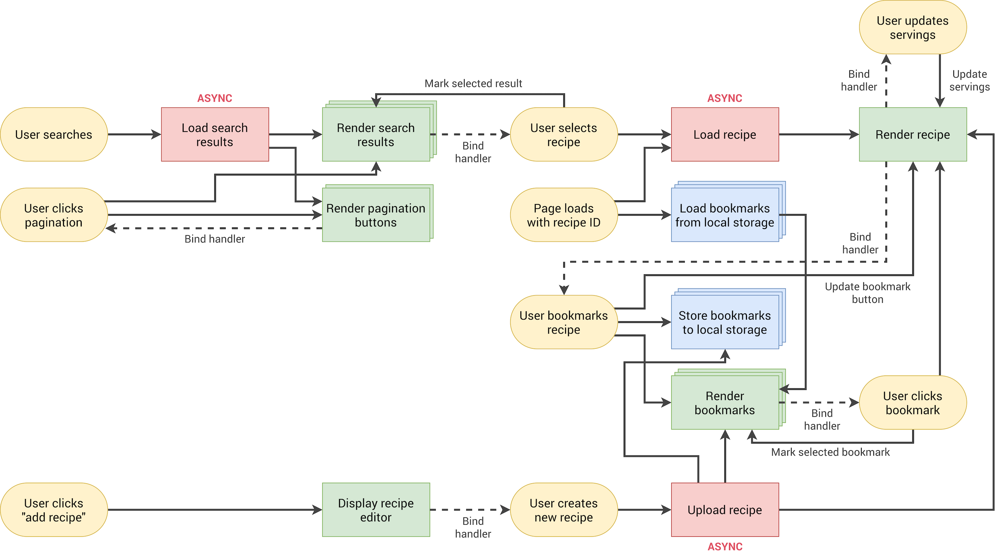
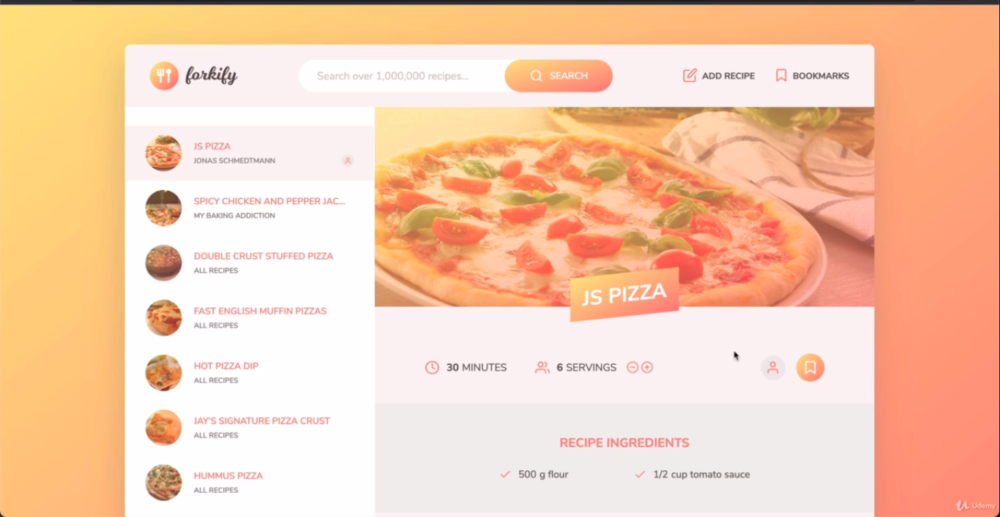
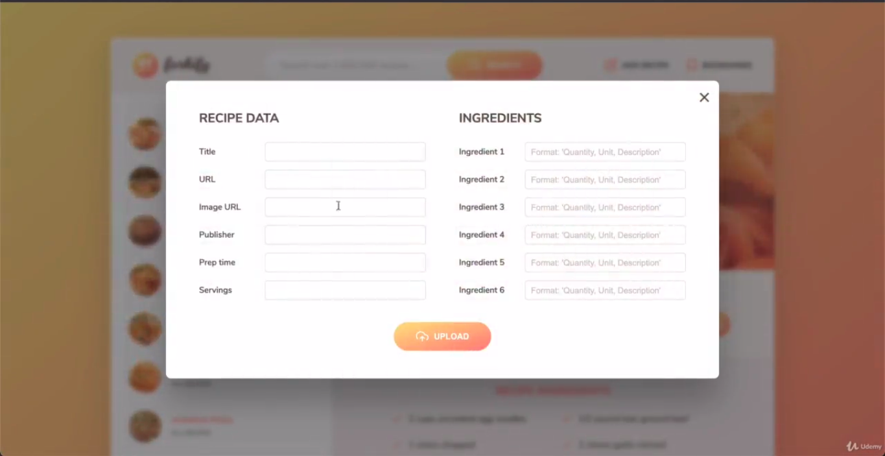
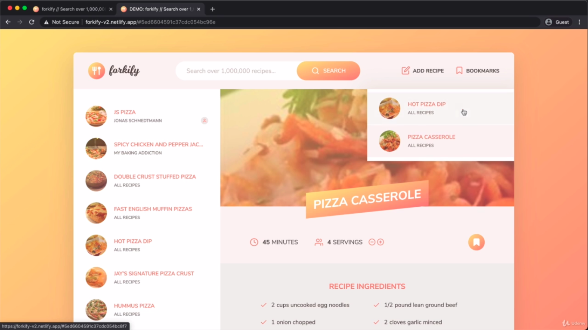

<h1>Forkify-App</h1>
<h2>A recipe sharing Web-application made with Html,Css and Javascript</h2>
 

<h3> It is application where each user can share their recipes and know others recipes </h3>
  
<h3> Architecture of Application </h3>

 
<h3> Flow-Chart of Application </h3>

  
<h3>Here is the Glimpse of Application </h3>

 
 
  
<h4> I learnt Javascript and then implemented that in this project</h4> 
